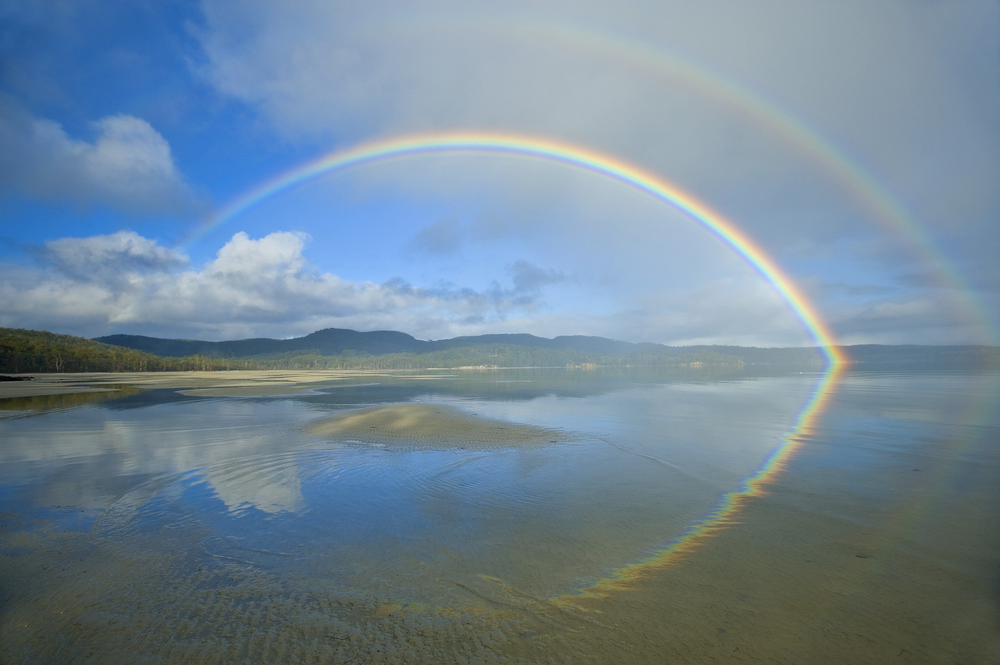
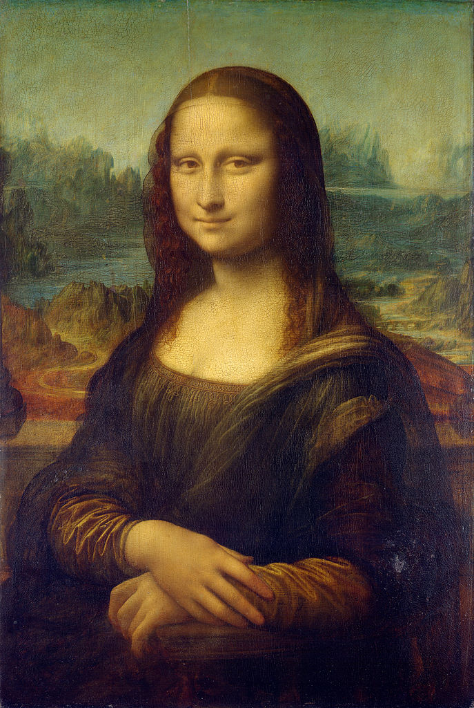

# PoissonImage

This is an implementation of the technique described in the paper Poisson Image Editing. It allows realistic blending of images.

I based some parts off the source below, namely the pixel selection.

## Examples
### Rainbow

### Face swap

## Links
Paper: https://www.cs.jhu.edu/~misha/Fall07/Papers/Perez03.pdf  
Great explanation/source: http://www.ctralie.com/Teaching/PoissonImageEditing/
